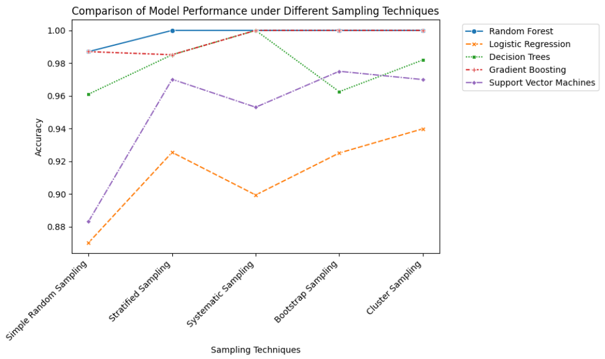
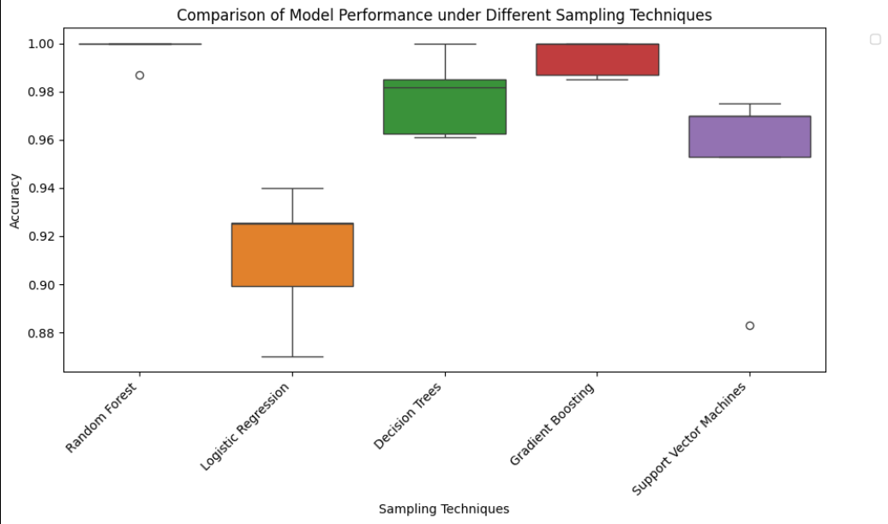

# ML Sampling Project

This project investigates the impact of different sampling techniques on the performance of machine learning models. Sampling plays a crucial role in handling imbalanced datasets and ensuring model generalization. In this project, we explore five common sampling techniques and evaluate their effects on five popular machine learning models.

## Introduction

In machine learning, sampling techniques are essential for handling datasets with class imbalances, skewed distributions, or specific characteristics that may affect model training and evaluation. This project aims to compare the performance of various machine learning models under different sampling strategies.

## Sampling Techniques

### 1. Simple Random Sampling

Simple random sampling involves randomly selecting a subset of data points without any specific criteria. It's a basic and commonly used sampling technique.

### 2. Stratified Sampling

Stratified sampling ensures that the proportion of each class in the sample reflects the proportion in the entire dataset. This is particularly useful when dealing with imbalanced datasets.

### 3. Systematic Sampling

Systematic sampling involves selecting every k-th element from the dataset after a random starting point. It's a deterministic sampling method that provides a representative sample.

### 4. Bootstrap Sampling

Bootstrap sampling involves repeatedly sampling with replacement from the dataset. It is often used for estimating the distribution of a statistic.

### 5. Cluster Sampling

Cluster sampling divides the dataset into clusters and randomly selects entire clusters to form the sample. It is useful when the dataset has a natural grouping.

## Machine Learning Models

### 1. Random Forest

A versatile ensemble learning method that constructs a multitude of decision trees during training and outputs the mode of the classes for classification problems.

### 2. Logistic Regression

A linear model for binary and multiclass classification that predicts the probability of a sample belonging to a particular class.

### 3. Decision Trees

A non-linear model that recursively splits the data based on features, creating a tree-like structure for classification and regression tasks.

### 4. Gradient Boosting

An ensemble learning method that builds a sequence of weak learners (usually decision trees) and combines them to create a strong learner.

### 5. Support Vector Machines

A powerful classification algorithm that finds the hyperplane that best separates the data into different classes.

## Results and Analysis

The table below shows the accuracy of each model under different sampling techniques:

## Results

The table below shows the accuracy of each model under different sampling techniques:

| Model                   | Simple Random Sampling | Stratified Sampling | Systematic Sampling | Bootstrap Sampling | Cluster Sampling |
|-------------------------|------------------------|---------------------|----------------------|---------------------|-------------------|
| Random Forest           | 0.9870                 | 1.0000              | 1.000                | 1.000               | 1.000             |
| Logistic Regression     | 0.8701                 | 0.9254              | 0.8993               | 0.9250              | 0.9398            |
| Decision Trees          | 0.9610                 | 0.9851              | 1.000                | 0.9625              | 0.9819            |
| Gradient Boosting       | 0.9870                 | 0.9851              | 1.000                | 1.000               | 1.000             |
| Support Vector Machines | 0.8831                 | 0.9701              | 0.9530               | 0.9750              | 0.9699            |

### Line plot:

### Box plot:

# Conclusion
- Random Forest: All sampling techniques except Stratified Sampling have the same accuracy.
- Logistic Regression: Systematic Sampling gives the highest accuracy.
- Decision Trees: Both Stratified Sampling and Bootstrap Sampling give the highest accuracy.
- Gradient Boosting: All sampling techniques except Simple Random Sampling give the same accuracy.
- Support Vector Machines: All sampling techniques except Simple Random Sampling give the same accuracy, with Bootstrap Sampling having the highest.

